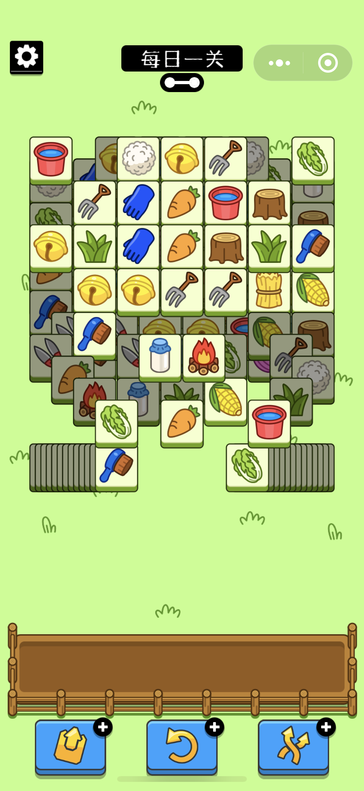
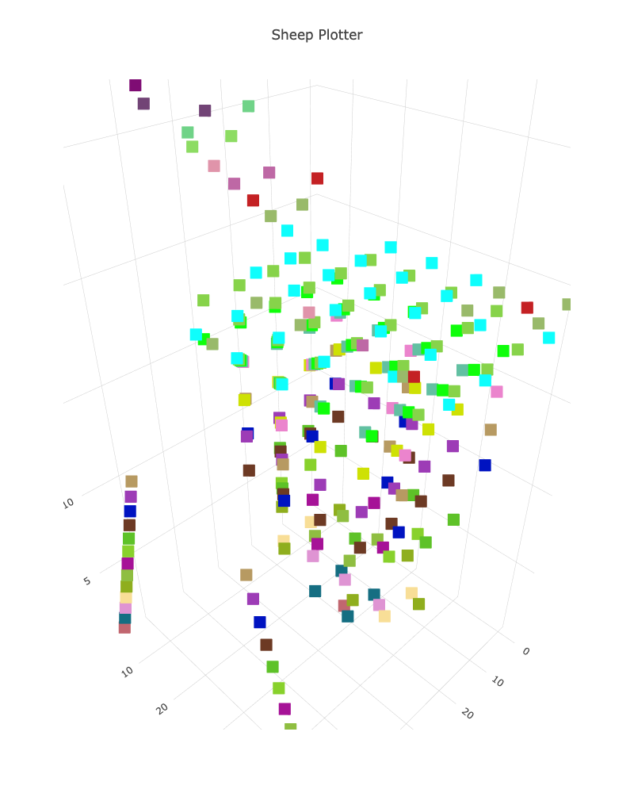

# sheep-a-sheep

My attempt to reverse engineer the notoriously frustrating WeChat game:

1. First, I performed Man-in-the-middle attack on my iPhone to intercept the network requests performed by Sheep-A-Sheep.
2. I discovered `map_data.json`, `map_meta_data.json`, which I then parsed to get `coordinates.txt`
3. I plotted the coordinates of the map to reveal the inner structure of the game

## The game

## The hidden structure

